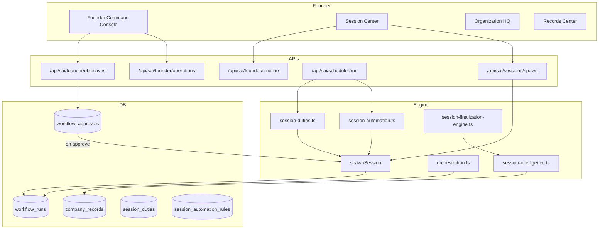
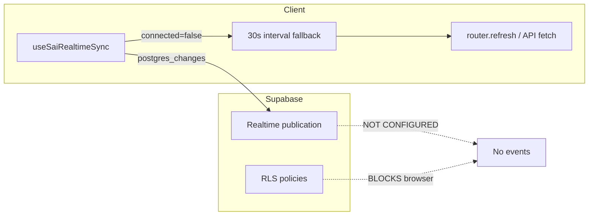

# Company Operating System (COS) — Operational Audit

**Date:** June 14, 2026  
**Scope:** Session Architecture v2 (Phases 1–10), Founder Command, Session Center, Organization HQ, Records Center, live sync, and founder control flows.  
**Purpose:** Determine what is **actually working** vs **demo/UI shell**, document bugs and architecture gaps, and define a fix order so the founder can create, control, and observe company execution in real time.

---

## 1. Executive Summary

### Verdict: **Hybrid — real backend, broken live layer**

The COS is **not a pure demo**. Core backend paths are wired to Supabase:

- Sessions are real rows in `workflow_runs`
- Templates, duties, automation rules, tool registry, and company records have real tables and server libs
- Agent execution, orchestration, approvals, and finalization engines exist and run server-side
- Founder Operations Chat **answers** are built from live DB snapshots

However, the **founder experience feels dead** because:

1. **Supabase Realtime is not fully provisioned** (no migration adds tables to `supabase_realtime` publication; several subscribed tables have RLS enabled with **no SELECT policies**).
2. **Global live refresh wrapper is never mounted** (`SaiRealtimeRefresh` exists but is not used in `app/sai/layout.tsx`).
3. **Fallback polling is 30 seconds**, further throttled to 4–15 seconds per page.
4. **Many pages are SSR-only** with no client refresh (Records Center, main dashboard, Control Panel).
5. **Session visibility logic hides sessions** from registry views (orphaned `awaiting_approval` bucket, `paused` → archived).
6. **Founder “Launch Objective” does not create a session immediately** — it creates a strategic approval first; session appears only after approval.
7. **Founder Operations Chat messages are not persisted** — Q&A is lost on navigation/refresh (only action proposals persist).

**Bottom line:** The COS can run sessions in the background, but the UI does not reliably reflect state, give founder control, or preserve conversation history. Fixing live infrastructure + session visibility is required before Phase 11+ features.

---

## 2. What You Reported vs Root Cause

| Symptom | Root cause (confirmed in code) |
|--------|--------------------------------|
| Chat not saved / not continued | `FounderOperationsChat` uses `useState` only (`founder-operations-chat.tsx:27`). No DB table for founder Q&A history. |
| Pages not updating live | Realtime likely never connects; 30s polling fallback; many pages have zero sync. |
| Organization / Agent Roster “dead” | Inherits `router.refresh()` from org view; only fires when realtime connects or every 30s. |
| Session Center Dashboard “dead” | Timeline refetches via API, but duties/templates/automation are SSR-only; realtime debounce 8s + 30s fallback. |
| Only Session #7 visible | Bucket classification hides other sessions (see §5). |
| Metrics/alerts show wrong or zero numbers | Metrics are computed from timeline — if timeline is empty/stale/wrong buckets, all numbers are wrong. |
| Unable to close session | Finalization requires `knowledge_archive_v1` artifact + intelligence extraction (`session-finalization-engine.ts:214–263`). Close via chat submits request, does not force-close. |
| Founder creates objective — nothing happens | Instant create → approval queue, not `spawnSession` (`founder-objectives.ts:160–171`). Session created on strategic approval only. |

---

## 3. Architecture (Intended vs Actual)

### 3.1 Intended architecture



### 3.2 Actual live-update architecture (broken path)



**Key file:** `lib/sai/use-sai-realtime-sync.ts`

- Subscribes to `postgres_changes` on configurable tables
- Debounce: 2–2.5s; min interval between refreshes: 4–15s
- If not `SUBSCRIBED`: polls every **30 seconds**
- Returns `{ connected }` for UI indicator (amber = polling)

**Key gap:** `components/sai/sai-realtime-refresh.tsx` wraps children with global refresh but is **never imported** in `app/sai/layout.tsx`.

---

## 4. Feature Status Matrix

| Area | DB wired? | Runtime works? | UI live? | Demo/fallback? |
|------|-----------|----------------|----------|----------------|
| Founder Launch Objective | Yes | Yes (approval path) | Partial | No instant session |
| spawnSession (scheduled/duty/auto) | Yes | Yes when triggered | Partial | — |
| Session Center timeline | Yes | Yes | Partial (timeline only) | Empty if no user |
| Session Center duties/automation | Yes | Yes (manual/cron) | Static SSR props | Static constants unused |
| Scheduler cron | Yes | **Only if CRON_SECRET set** | Manual button works | — |
| Organization / Agent Roster | Yes | Yes | Partial (30s max) | — |
| Records Center | Yes | Yes | **No** | — |
| Founder Operations Chat answers | Yes | Yes | N/A | — |
| Founder Operations Chat history | **No** | — | Lost on refresh | In-memory only |
| Session close/finalize | Yes | Blocked without knowledge | Via chat approval | — |
| Intelligence → Records | Yes | On finalization | Records static | — |
| Tool permissions | Yes | At agent execution | Display only | — |
| Custom agents | Yes | API works | Partial | — |

### Static constants (spec catalog — NOT used in UI)

Defined in `lib/sai/session-center.ts`:

- `SESSION_TEMPLATES` (lines 30–103)
- `SESSION_DUTIES` (lines 105–115)
- `SESSION_AUTOMATIONS` (lines 117–125)

Grep confirms **no imports** outside that file. Live UI reads DB via `getSessionTemplates`, `getSessionDuties`, `getAutomationRules`.

---

## 5. Why Only Session #7 Appears (Session History Bug)

`getFounderSessionTimeline()` (`lib/sai/founder-timeline.ts`) classifies every `workflow_runs` row into buckets, then exposes only these lists:

```typescript
activeSessions: byBucket("active"),
completedSessions: byBucket("completed"),
archivedSessions: byBucket("archived"),
cancelledSessions: byBucket("cancelled"),
blockedSessions: byBucket("blocked"),
needsFounderReview: byBucket("needs_founder_review"),
```

### Bug A — `awaiting_approval` bucket is orphaned

`classifyBucket()` (line 96) returns `"awaiting_approval"` when:

- `session_status === "waiting_approval"`, OR
- `pendingApprovalCount > 0`

But timeline assembly **never includes** `byBucket("awaiting_approval")`. Those sessions **vanish** from all registry sidebars.

### Bug B — `paused` workflow status → archived

```typescript
if (status === "running") return "active";
return "archived";
```

Scheduled/deferred sessions from `spawnSession` use `status: "paused"` → appear under **Archived**, not Active or Scheduled.

### Bug C — Scheduled registry is future-only

`getScheduledSessions()` queries `scheduled_at > now()`. Past-due paused sessions are not in Scheduled or Active.

### Bug D — Completed → archived after 30 days

Sessions completed more than 30 days ago move to Archived automatically.

### Bug E — `session_number` may be null

Legacy rows without `session_number` show as `#—` and may not match search.

### Likely explanation for “only #7”

Sessions 1–6 are probably in one of:

- `awaiting_approval` (invisible)
- `archived` (paused status or age)
- `blocked` / `needs_founder_review`
- Still `running` but stale (only latest feels “active”)

**Fix:** Add `awaitingApprovalSessions` bucket to timeline + registry; treat `paused` + future `scheduled_at` as scheduled; add “All Sessions” view.

---

## 6. Founder Control Flow Gaps

### 6.1 Launch Objective (two-step, not one-click)

**UI:** `SessionCreatePanel` instant mode → `POST /api/sai/founder/objectives`  
**Server:** `submitFounderObjective()` (`founder-objectives.ts`)

1. `assertNoActiveSession` — blocks if another session is active
2. Creates `project_objectives` row
3. CEO agent runs strategy
4. Creates `strategic_objective` approval — **no `workflow_runs` insert**
5. Returns approval ID

**Session is created in `activateSession()`** only when founder approves strategic objective (`governance.ts`).

**Impact:** Founder clicks “Launch Objective” and sees approval queue activity, not a new session in Active registry.

### 6.2 Session close

Finalization chain (`session-finalization-engine.ts`):

1. Requires artifact `knowledge_archive_v1`
2. Auto-completes incomplete steps
3. Publishes completion artifacts
4. **Mandatory** `extractSessionIntelligence()` → `company_records`
5. Then `closeSession()`

Founder chat “Close Session” → `requestSessionClose()` (approval-style), not immediate force-close.  
“Force Complete Session” → `forceFinalizeSession()` — still subject to knowledge gates unless bypassed.

### 6.3 Founder Operations Chat

| Capability | Persisted? | Location |
|------------|------------|----------|
| Q&A messages | **No** | React state only |
| Action proposals | Yes | `founder_chat_actions` |
| Action execution logs | Yes | `founder_chat_action_logs` |
| Live answers | Built on demand | `collectFounderIntelligenceSnapshot()` |

**Bug:** Realtime hook is a no-op:

```typescript
useSaiRealtimeSync(() => {}, ["founder_chat_actions", "ai_retry_queue"]);
```

Subscribes but never refreshes UI when actions execute.

---

## 7. Live Sync — Page-by-Page

| Page / Component | Sync mechanism | Refresh interval (worst case) | Connection indicator |
|------------------|----------------|------------------------------|----------------------|
| Session Center | API refetch timeline | 30s + 8s throttle | Yes |
| Organization HQ | `router.refresh()` | 30s + 5s throttle | Yes |
| Founder Command Console | `router.refresh()` | 30s + 4s throttle | No |
| Founder Workspace (rest) | Depends on console refresh | 30s | No |
| Session Workspace | API fetch | 30s + 8s throttle | No |
| Records Center | **None** | Never | No |
| SAI Dashboard (`/sai`) | **None** | Never | No |
| Control Panel | **None** | Never | No |
| Execution Center | `router.refresh()` | 30s | No |

### Dead code (built but not mounted)

| Component | File | Notes |
|-----------|------|-------|
| `SaiRealtimeRefresh` | `components/sai/sai-realtime-refresh.tsx` | Global wrapper — **not in layout** |
| `FounderCommandCenterView` | `components/sai/founder-command-center-view.tsx` | Has 10s version polling — **unused** |
| `PendingApprovalsBanner` | `components/sai/pending-approvals-banner.tsx` | **Not rendered** on founder page |
| `FounderSessionTimelines` | `components/sai/founder-session-timelines.tsx` | **Not rendered** |

---

## 8. Realtime Infrastructure Gaps (P0)

### 8.1 No Realtime publication migration

Searched all `supabase/migrations/` — **zero** entries for:

- `supabase_realtime` publication
- `REPLICA IDENTITY`
- `ALTER PUBLICATION ... ADD TABLE`

Without this, `useSaiRealtimeSync` will almost always show **Polling** (amber dot).

### 8.2 RLS enabled, no SELECT policies

Tables with RLS but **no read policy** (browser client cannot subscribe):

| Table | Migration |
|-------|-----------|
| `session_handoffs` | `021_session_handoffs.sql` |
| `ai_retry_queue` | `031_context_isolation_and_reliability.sql` |
| `founder_chat_actions` | `031_context_isolation_and_reliability.sql` |
| `founder_chat_action_logs` | `031` |
| `ai_execution_events` | `027_ai_reliability.sql` |

Server code uses admin client (bypasses RLS). Browser realtime uses anon/authenticated client — **subscriptions fail silently**.

### 8.3 Scheduler auth in production

`vercel.json` cron hits `/api/sai/scheduler/run` hourly.

Auth (`app/api/sai/scheduler/run/route.ts`):

1. `Authorization: Bearer ${CRON_SECRET}` → allowed
2. Else logged-in `role === "owner"`

**Without `CRON_SECRET` in Vercel env**, cron gets **401**. Duties/automation only run when founder clicks **Run Scheduler Now**.

### 8.4 Automation limitations

| Feature | Status |
|---------|--------|
| `runScheduledAutomations` | Naive interval, not real cron parsing |
| `fireAgentAutomation` | **Defined, never called** |
| `recurrence_rule` on sessions | Stored, no respawn listener |
| `trigger_metadata.armed` | Stored, no event listener for manual triggered sessions |

---

## 9. Session Architecture Phases 1–10 — Honest Status

| Phase | Deliverable | Backend | UI | Live |
|-------|-------------|---------|-----|------|
| 1 | Template engine | ✅ | ✅ DB templates | ⚠️ |
| 2 | Type system | ✅ | ✅ | ⚠️ |
| 3 | Ownership | ✅ | Partial (workspace API) | ⚠️ |
| 4 | Dependencies + Records schema | ✅ | Records static | ❌ |
| 5 | Knowledge extraction | ✅ on finalize | ✅ tabs | ⚠️ |
| 6 | Duty auto-generation | ✅ | ✅ | ⚠️ |
| 7 | Automation engine | ⚠️ partial | ✅ | ⚠️ |
| 8 | Custom agent framework | ✅ | ✅ | ⚠️ |
| 9 | Tool permission matrix | ✅ runtime | ✅ display | — |
| 10 | Multi-agent runtime | ⚠️ parallel step pick only | — | ⚠️ |

**Phases 1–10 are architecturally present but operationally incomplete** until live sync, session visibility, and founder one-click create are fixed.

---

## 10. Bug Catalog (Prioritized)

### P0 — System feels dead

| ID | Bug | File(s) | Fix |
|----|-----|---------|-----|
| P0-1 | No Realtime publication | New migration | `ALTER PUBLICATION supabase_realtime ADD TABLE ...` for all watched tables |
| P0-2 | RLS blocks browser subscriptions | `031`, `021`, `027` | Add `{table}_select` policies for authenticated users |
| P0-3 | `SaiRealtimeRefresh` not mounted | `app/sai/layout.tsx` | Wrap `{children}` with `<SaiRealtimeRefresh>` |
| P0-4 | `awaiting_approval` sessions invisible | `founder-timeline.ts` | Add bucket to timeline + registry section |
| P0-5 | `paused` sessions mis-bucketed | `founder-timeline.ts` | New bucket: `scheduled` / `deferred` |

### P1 — Founder control broken

| ID | Bug | File(s) | Fix |
|----|-----|---------|-----|
| P1-1 | Instant objective ≠ instant session | `session-center-view.tsx`, `founder-objectives.ts` | Option A: spawn immediately; Option B: clear UX “pending approval” |
| P1-2 | Chat history not saved | `founder-operations-chat.tsx` | New `founder_operations_messages` table + load on mount |
| P1-3 | Chat realtime noop | `founder-operations-chat.tsx:33` | Refresh messages / action status on events |
| P1-4 | Session Center partial refresh | `session-center-view.tsx` | `router.refresh()` or fetch duties/automation on sync |
| P1-5 | Timeline API founder-only vs SSR any-user | `page.tsx`, `timeline/route.ts` | Align auth requirements |
| P1-6 | `CRON_SECRET` not documented/required | `vercel.json`, README | Env var + deploy checklist |

### P2 — UX / correctness

| ID | Bug | File(s) | Fix |
|----|-----|---------|-----|
| P2-1 | Records Center no live sync | `records-center-view.tsx` | Subscribe to `company_records` + poll API |
| P2-2 | Main dashboard static | `app/sai/page.tsx` | Add polling or layout refresh |
| P2-3 | 30s polling too slow | `use-sai-realtime-sync.ts` | Reduce to 10–15s when disconnected |
| P2-4 | `useDebouncedRouterRefresh(15_000)` too conservative | Multiple views | Lower to 5s for command surfaces |
| P2-5 | SSR state drift | Client views | `useEffect` sync `initialTimeline` prop |
| P2-6 | Analytics label “Automation Success” shows count | `session-center-view.tsx` | Rename or compute real success rate |
| P2-7 | Wire `PendingApprovalsBanner` on founder page | `founder-workspace-view.tsx` | Mount component |

### P3 — Automation completeness

| ID | Bug | Fix |
|----|-----|-----|
| P3-1 | `fireAgentAutomation` unused | Call from CEO monitor / agent signals |
| P3-2 | Recurring sessions don't respawn | Scheduler listener on `recurrence_rule` |
| P3-3 | Triggered sessions don't arm/fire | Wire `trigger_metadata` to `fireAutomationEvent` |
| P3-4 | Cron parsing naive | Use proper cron library |

---

## 11. Recommended Fix Order

### Sprint 1 — “Make it feel alive” (2–3 days)

1. Migration: Realtime publication + RLS SELECT policies
2. Mount `SaiRealtimeRefresh` in SAI layout
3. Fix `awaiting_approval` + `paused`/`scheduled` buckets
4. Add “All Sessions” registry (no bucket filter)
5. Set `CRON_SECRET` on Vercel; verify hourly scheduler

### Sprint 2 — “Founder control” (2–3 days)

1. Persist founder operations chat (`founder_operations_messages`)
2. Fix chat realtime callback
3. Clarify Launch Objective UX OR spawn session immediately with `pending_coo` status
4. Session Center full-page refresh on realtime
5. Mount `PendingApprovalsBanner` on founder workspace
6. Surface connection status on Founder Command Console

### Sprint 3 — “Complete COS loop” (3–5 days)

1. Records Center live sync
2. Session close UX: show finalization blockers + one-click force path for founder
3. Recurring/triggered session respawn
4. Wire `fireAgentAutomation`
5. Delete or integrate dead components (`FounderCommandCenterView`, etc.)

---

## 12. Verification Checklist (After Fixes)

Use this to confirm the COS is **working**, not demo:

- [ ] Session Center dot shows **green “Live sync”** (not amber Polling)
- [ ] Change a `workflow_runs` row in Supabase → UI updates within **5 seconds** without manual refresh
- [ ] Founder launches objective → session appears in correct registry within **10 seconds**
- [ ] Sessions 1–6 visible in Completed/Archived/Awaiting (not missing)
- [ ] Organization Agent Roster updates when session step changes
- [ ] Founder chat survives page navigation (messages reload from DB)
- [ ] Records Center shows new record after session finalization without reload
- [ ] Vercel cron log shows scheduler 200 (not 401)
- [ ] Duty “Run now” creates new session row in `workflow_runs`
- [ ] Close session shows clear blocker if knowledge gate fails; force path works when approved

---

## 13. Key File Index

| Concern | Path |
|---------|------|
| Realtime hook | `lib/sai/use-sai-realtime-sync.ts` |
| Global refresh (unmounted) | `components/sai/sai-realtime-refresh.tsx` |
| SAI layout | `app/sai/layout.tsx` |
| Session timeline / buckets | `lib/sai/founder-timeline.ts` |
| Session Center UI | `components/sai/session-center-view.tsx` |
| Session Center page | `app/sai/sessions/page.tsx` |
| Founder objectives | `lib/sai/founder-objectives.ts` |
| Founder operations chat | `lib/sai/founder-operations-chat.ts`, `components/sai/founder-operations-chat.tsx` |
| Founder command console | `components/sai/founder-command-console.tsx` |
| Organization HQ | `components/sai/organization-view.tsx`, `lib/sai/organization-headquarters.ts` |
| Records | `components/sai/records-center-view.tsx`, `lib/sai/company-records.ts` |
| Session spawn | `lib/sai/session-spawn.ts` |
| Scheduler | `app/api/sai/scheduler/run/route.ts`, `vercel.json` |
| Finalization / close | `lib/sai/session-finalization-engine.ts` |
| Migrations 033/034 | `supabase/migrations/033_session_architecture_v2.sql`, `034_session_phases_5_10.sql` |

---

## Implementation Status (June 2026)

| Sprint | Status | Key deliverables |
|--------|--------|------------------|
| Sprint 1 | Done | Migration 035, SaiRealtimeRefresh, session buckets, All Sessions registry, chat persistence, Records live sync |
| Sprint 2 | Done | Instant spawn, PendingApprovalsBanner, dashboard live, recurring scheduler, command console metrics |
| Sprint 3 | Done | SessionControlPanel, force finalize, triggered sessions, fireAgentAutomation, control panel live |


What was built is a **real Company Operating System skeleton with a working execution engine**, not a mock dashboard. The gap is in **operational wiring**:

- Live perception (realtime + polling)
- Session visibility (bucket bugs)
- Founder immediacy (approval-before-session)
- Conversation persistence
- Automated scheduler in production

Until Sprint 1 and Sprint 2 are complete, the COS will continue to feel like a demo even while Session #7 executes correctly in the background.

**Next action:** Execute Sprint 1 fixes starting with Realtime migration + `awaiting_approval` bucket — highest impact for everything you reported.
